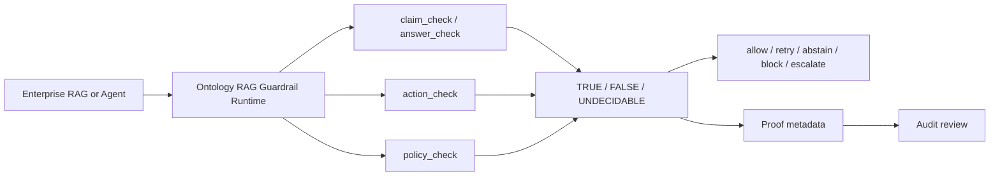

# Commercial Integration Diagram

## Integration Notes

- RAG teams usually start with `answer_check`.
- Agent teams usually start with `action_check`.
- Compliance teams usually start with `policy_check` and proof lookup.
- `UNDECIDABLE` should route to retrieval retry, human review, or escalation.
